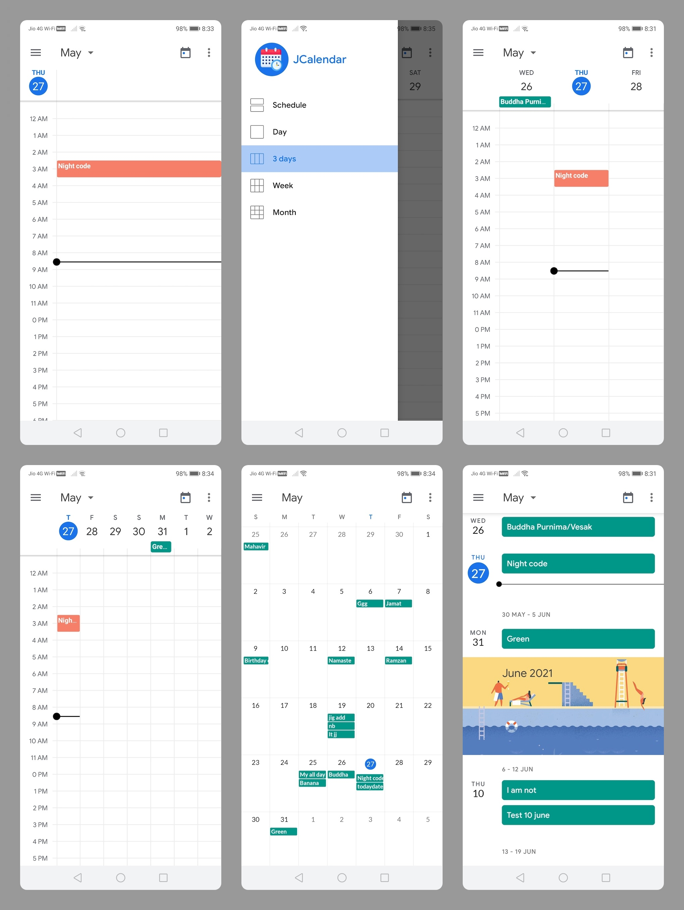

# JGoogle-Calendar

This repository contains an Android Calendar App that provides a user-friendly and feature-rich calendar experience for Android devices. The app allows users to manage their schedules, events, and reminders efficiently.

Sample Google Calendar project get all event information, holiday ,birthday, appointment etc from google account which is sync with your device and show different kind of layout with different color for event


Sample Google Calendar contains all the features that you find in other calendar app including Day view, Week view, Month Views, recent event, today event, easily navigation between monthview and calendarview and awesome design with all of this 

Make copy of the official Google Calendar app design and implement monthview,dayview,schedule,weekview,3 dayview and much more

• Different ways to view your calendar - Quickly switch between month, week and day view.

• Events from Gmail - Flight, hotel, concert, restaurant reservations and more are added to your calendar automatically.

### How set event information and minimum and maximum date of calendar
```java
//first param: HashMap<LocalDate,String[]> second and third param:LocalDate
            calendarView.init(eventlist,mintime,maxtime);
//string[]  if same day contain  more than one event
```
## Download apk

https://raw.githubusercontent.com/jignesh13/googlecalendar/jignesh13-apk-upload/app-debug.apk

https://user-images.githubusercontent.com/20221469/160238961-30cc2904-508c-4ccc-ab63-e162a86450d6.mp4

<!----->

 <!---[](https://www.youtube.com/watch?v=OV6SHoLu6c4)-->

 ## feature
- Intuitive and interactive calendar interface for seamless navigation and event management.
- Add, edit, and delete events with customizable details such as title, time, location, and reminders.
- View events in different calendar views (day, week, month) for a comprehensive overview.
- Quick access to upcoming events and agenda for efficient planning.
- Integration with device calendar to sync events with other applications.
- Customizable event categories and color-coded labels for easy organization.
- Reminder notifications and alerts for upcoming events.
- Support for recurring events and all-day events.
- User-friendly UI with smooth animations and transitions.
- Localization support for multiple language

## Getting Started

To use the Android Calendar App, follow these steps:

1. Clone or download the repository.
2. Open the project in Android Studio.
3. Build and run the app on an Android device or emulator.
4. Explore the different calendar views, create events, and manage your schedule.


 
 # Special thanks to these contributors
[AgendaCalendarView](https://github.com/Tibolte/AgendaCalendarView),[scrollparallaximageview](https://github.com/gjiazhe/ScrollParallaxImageView),[Android-Week-View](https://github.com/alamkanak/Android-Week-View)
 
##  Developer
  jignesh khunt
  (jigneshkhunt13@gmail.com)
  
  
## License
   Copyright 2019 jignesh khunt
   
   [License](https://github.com/jignesh13/googlecalendar/blob/master/LICENSE)
   
   Licensed under the Apache License, Version 2.0 (the "License");
   you may not use this file except in compliance with the License.
   You may obtain a copy of the License at

       http://www.apache.org/licenses/LICENSE-2.0

   Unless required by applicable law or agreed to in writing, software
   distributed under the License is distributed on an "AS IS" BASIS,
   WITHOUT WARRANTIES OR CONDITIONS OF ANY KIND, either express or implied.
   See the License for the specific language governing permissions and
   limitations under the License.
